P1. Conexiones de redes y gestión de recursos en Linux

1. Identificación de interfaces de red
Uso ip a para ver las especificaciones de red

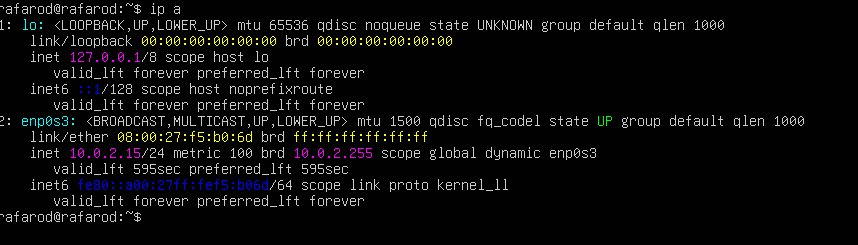

¿Qué interfaz de red está activa?

enp0s3

¿Qué dirección IP tiene asignada actualmente?

No tiene una direccion valida porque estoy en red nat y todavia no he hecho el netplan

¿Qué dirección MAC tiene la interfaz?

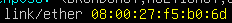

¿A qué red pertenece la dirección IP?

No está realizado el enrutamiento pero la redd a la que pertenece debe acabar en 0

2. Identificación de la configuración de red
Uso ip addr para ver las direcciones IP del sistema.
Uso ip route para ver las rutas de red.

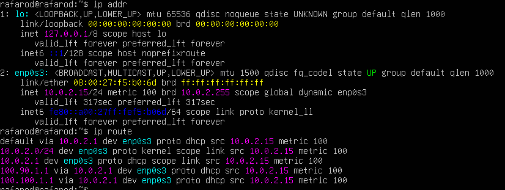

¿Qué red local aparece configurada?
Ninguna por lo ya comentado
¿Qué interfaz se utiliza para acceder a esa red?
enp0s3
¿Existe una puerta de enlace configurada?
no de momento.

3. Configuración del nombre de host
Con hostname reviso el nombre actual del sistema

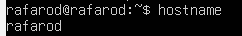

Configuro el nombre del servidor con sudo hostnamectl set-hostname srv01

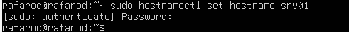

lo compruebo

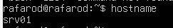

Configuro el nombre del cliente con sudo hostnamectl set-hostname cli01

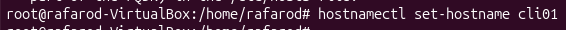

Lo compruebo

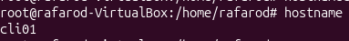

No he podido hacer capturas antes del cambio porque ya lo habia cambiado antes de leer la última linea del ejercicio.
----------------------------------
Edito el archivo de configuración de red:

SERVER

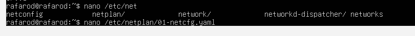

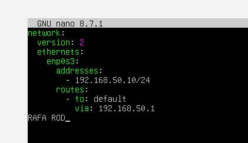

CLIENTE

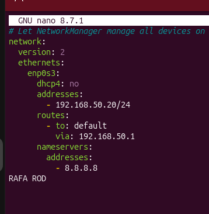

Pongo RAFA ROD de manera provisional para demostrar que el enrutamiento es mío.

Aplico la configuración

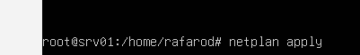

compruebo la configuración en el servidor

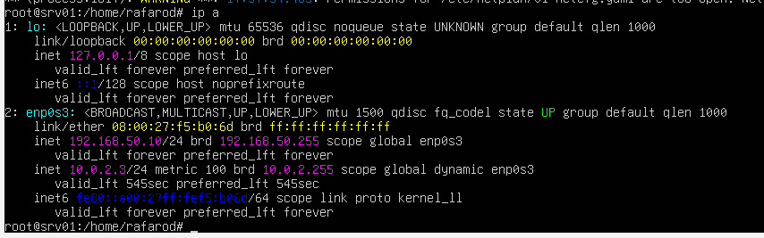

Y en el cliente

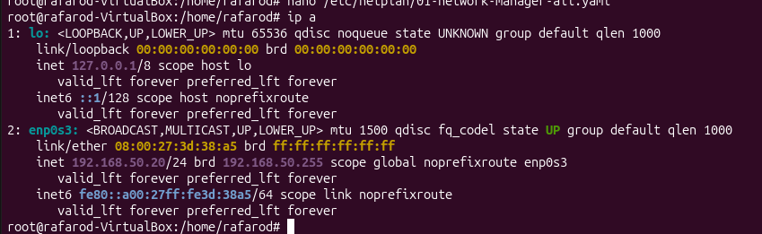

dhcp4: no → desactiva DHCP.

addresses → IP fija.

gateway4 → puerta de enlace.

nameservers → DNS.

Uso ping para comprobar que las dos maquinas están conectadas

Servidor

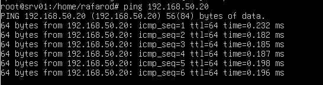

Cliente

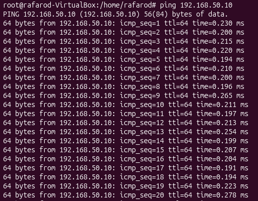

¿Se reciben respuestas del otro equipo?

Sí se reciben respuestas.

¿Cuántos paquetes se envían y reciben?

Se envian paquetes icmp sin parar hasta que lo paro yo.

¿Qué información muestra el comando ping?

Muestra tiempo de respuesta y pérdida de paquetes.

icmp_seq → número de paquete.

ttl → tiempo de vida.

time → latencia.

Añado estas dos entradas al fichero sudo nano /etc/hosts tanto en el servidor como en el cliente

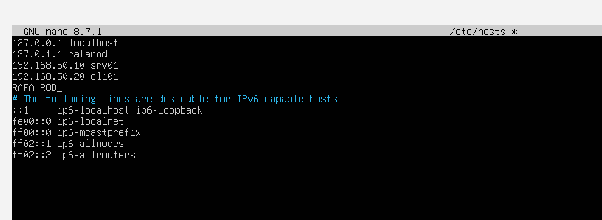
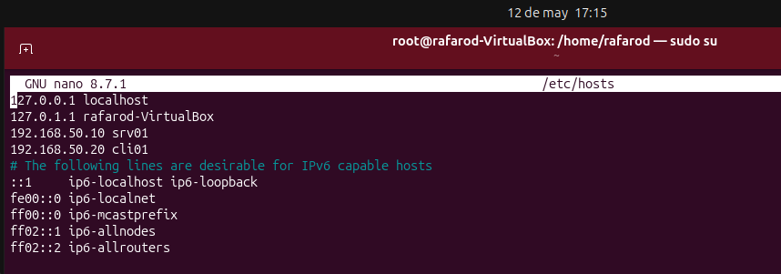

compruebo que funciona

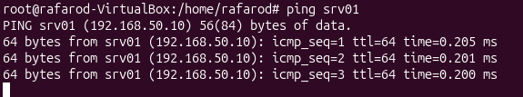

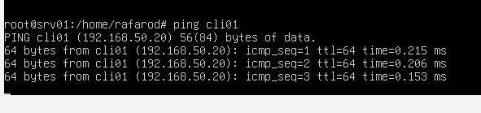

El archivo /etc/hosts relaciona nombres con direcciones IP localmente.

Muestro la tabla de rutas del sistema

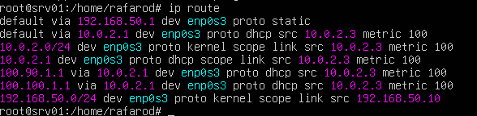

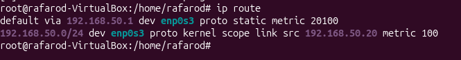

¿Qué red aparece en la tabla de rutas?

192.168.50.0/24

¿Qué interfaz se utiliza para acceder a esa red?

enp0s3

¿Qué significa cada columna mostrada en la tabla?

Explicación de cada campo

192.168.50.0/24	            Red de destino
default	                    Ruta por defecto utilizada para salir a otras redes
via 192.168.50.1	        Puerta de enlace (gateway)
dev enp0s3	                Interfaz de red utilizada
proto kernel	            Ruta creada automáticamente por el kernel
scope link	                La red es directamente accesible
src 192.168.50.10	        Dirección IP origen del equipo

Muestra los puertos abiertos en el sistema con ss -tuln

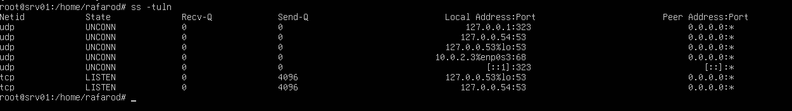

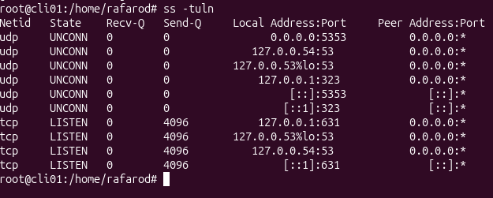

1. Puertos Abiertos
Los puertos se identifican en la columna Local Address:Port después de los dos puntos (:).

En srv01 (servidor): Aparecen abiertos los puertos 53 (DNS), 68 (DHCP) y 323 (NTP/Chrony).

En cli01 (cliente): Además de los anteriores, aparece el puerto 631 (servidor de impresión CUPS) y el 5353 (mDNS/Avahi).

En srv01:
53: Utilizado tanto en TCP como en UDP.

68: Utilizado en UDP.

323: Utilizado en UDP (tanto en IPv4 como en IPv6).

En cli01:
53: Utilizado tanto en TCP como en UDP.

323: Utilizado en UDP (IPv4 e IPv6).

631: Utilizado en TCP (IPv4 e IPv6).

5353: Utilizado en UDP (IPv4 e IPv6).

2. Significado de las Columnas
La salida del comando ss organiza la información en las siguientes seis columnas:

Netid: Indica el tipo de protocolo de red o transporte utilizado (en este caso, udp o tcp).

State: Muestra el estado del socket. LISTEN indica que el puerto está a la espera de conexiones (típico de TCP), mientras que UNCONN indica un socket UDP que no mantiene una conexión persistente.

Recv-Q: La "Cola de Recepción" muestra la cantidad de datos recibidos que aún no han sido leídos por la aplicación.

Send-Q: La "Cola de Envío" muestra la cantidad de datos enviados que aún no han sido confirmados por el receptor.

Local Address:Port: Muestra la dirección IP local y el número de puerto donde el servicio está escuchando.

Peer Address:Port: Muestra la dirección y el puerto del extremo remoto. En servicios que están esperando conexiones (escucha), suele aparecer como 0.0.0.0:* o [::]:*.

3. Protocolos Utilizados
En ambas imágenes se están utilizando los dos protocolos principales de la capa de transporte del modelo TCP/IP:

UDP (User Datagram Protocol): Protocolo sin conexión, visible en las filas marcadas como udp.

TCP (Transmission Control Protocol): Protocolo orientado a la conexión, visible en las filas marcadas como tcp.

En el servidor ejecuto:

sudo apt update

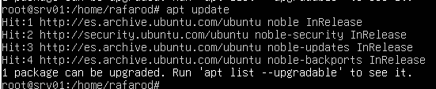

sudo apt install openssh-server

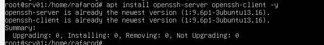

Compruebo el estado del servicio:

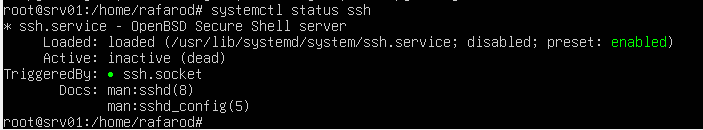

Compruebo que el puerto está abierto:

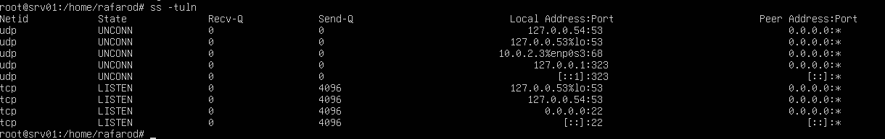

SSH permite administrar el servidor remotamente de forma segura.

https://www.openssh.org/manual.html?utm_source=chatgpt.com

Desde cli01, establece una conexión SSH con el servidor:

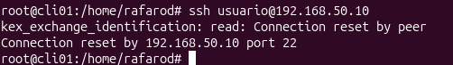

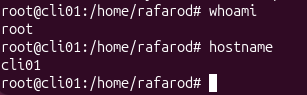

Fallo de conexión: Al ejecutar el comando ssh usuario@192.168.50.10, el sistema devuelve el error Connection reset by peer. Esto indica que, aunque el cliente intentó conectar al puerto 22 del servidor, la conexión fue rechazada o cerrada inmediatamente por la máquina remota.

Usuario conectado: El usuario que está operando actualmente es root, como lo confirma la salida del comando whoami ejecutado tras el fallo del SSH.

Máquina donde se ejecutan los comandos: Los comandos se están ejecutando en la máquina local cli01, tal como muestra el prompt del sistema (root@cli01) y la salida del comando hostname. No se ha logrado acceder al servidor srv01.

Causas probables del error
Dado que el servidor SSH dio problemas de instalación previamente, este error en image_2ca61a.png suele deberse a:

El servicio SSH en el servidor (srv01) no está corriendo o no se ha iniciado correctamente tras los errores de dependencias.

Un firewall (como ufw) está bloqueando la conexión entrante en el servidor.

El servicio SSH está instalado pero configurado para rechazar conexiones de ciertos usuarios o IPs.

https://man7.org/linux/man-pages/man1/ssh.1.html?utm_source=chatgpt.com

Muestro el estado de las interfaces ejecutando:

ip link

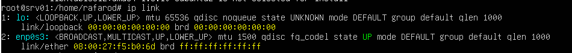

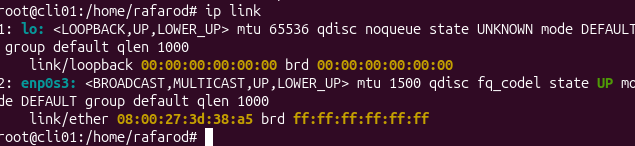

En srv01

Interfaces presentes:

lo: Interfaz de loopback.

enp0s3: Interfaz de red Ethernet.

Estado de las interfaces:

lo: Al igual que en el cliente, muestra <UP,LOWER_UP> con un estado operativo UNKNOWN.

enp0s3: Se encuentra en estado UP.

Información adicional:

La dirección MAC de la interfaz enp0s3 en el servidor es 08:00:27:f5:b0:6d.

En cli01

Interfaces presentes:

lo: Interfaz de loopback o retorno local.

enp0s3: Interfaz de red Ethernet principal.

Estado de las interfaces:

lo: Se encuentra en estado UNKNOWN (operativamente), aunque tiene las banderas <UP,LOWER_UP>, lo que indica que la interfaz está activa para el sistema.

enp0s3: Se encuentra en estado UP, lo que confirma que tiene conectividad física y lógica activa.

Información adicional:

La dirección MAC (link/ether) de la interfaz enp0s3 es 08:00:27:3d:38:a5.

El MTU (Unidad Máxima de Transmisión) está configurado en 1500 para Ethernet y 65536 para loopback.

https://man7.org/linux/man-pages/man8/ip-link.8.html?utm_source=chatgpt.com

Muestro las entradas de la tabla ARP ejecutando:

ip neigh

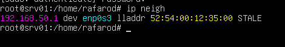

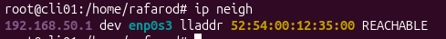

¿Qué dirección IP aparece asociada a la otra máquina?

192.168.50.1

¿Qué dirección MAC tiene?

52:54:00:12:35:00

La relación entre ambas direcciones se gestiona a través del Protocolo ARP (Address Resolution Protocol). Sus funciones y diferencias son:

Dirección IP (Capa 3 - Red): Es una dirección lógica que identifica a un dispositivo dentro de una red más amplia o en Internet. Sirve para enrutar los paquetes desde el origen hasta la red de destino.

Dirección MAC (Capa 2 - Enlace de Datos): Es una dirección física y única grabada en la tarjeta de red (NIC) del dispositivo. Solo sirve para la comunicación directa dentro de la misma red local (LAN).

Creo un archivo de texto desde el cliente

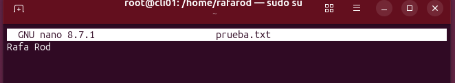

Copio el archivo al servidor utilizando:

scp prueba.txt usuario@192.168.50.10:/home/usuario

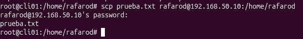

Compruebo que el archivo está en el servidor

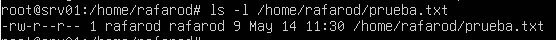

El proceso sigue estos pasos técnicos:

Establecimiento de conexión: El cliente (cli01) inicia una conexión SSH al servidor (srv01) a través del puerto 22.

Autenticación del Servidor: El servidor presenta sus Host Keys. Si estas faltan (como vimos en image_a0a81d.png), la conexión falla. Una vez presentadas, el cliente las verifica.

Autenticación del Usuario: El usuario se identifica. En tus pruebas vimos que es crítico usar el nombre de usuario correcto (rafarod en lugar de usuario) y su contraseña válida (image_a0a062.png vs image_a04a7f.png).

Transferencia de datos: Una vez autenticado, scp inicia un proceso en el servidor para recibir los datos. El archivo se envía cifrado, garantizando que nadie pueda interceptar su contenido durante el trayecto por la red.

Escritura en destino: El servidor intenta escribir el archivo en la ruta indicada. Como vimos en image_a04a7f.png, el usuario debe tener permisos de escritura en la carpeta de destino.

Documentación

Manual de Linux (Man pages):

man scp: Para la sintaxis y opciones del protocolo de copia segura.

man sshd: Para entender el funcionamiento del demonio del servidor y sus requisitos de llaves de host.

man ssh-keygen: Para la generación de identidades criptográficas.

En el servidor ejecuto:

sudo systemctl stop ssh

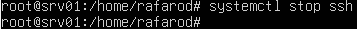

Compruebo si el puerto sigue abierto:

ss -tuln

Compruebo si el puerto sigue abierto:

ss -tuln

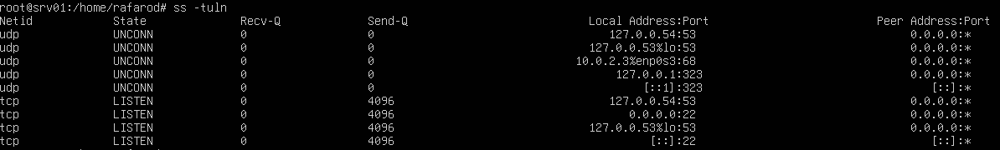

Me intento conectar desde el cliente

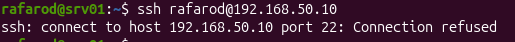

Vuelvo a iniciar el servicio

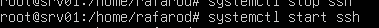

1. Pruebas realizadas y comportamiento del servicio
Cuando intenté detener el servicio en srv01, el sistema operativo Ubuntu mostró un comportamiento específico de las versiones modernas de systemd.

A. Estado con el servicio detenido (pero con socket activo)
Al ejecutar systemctl stop ssh, la terminal advirtió que ssh.socket permanecía activo.

Qué ocurre: El demonio principal se apaga, pero el "socket" de escucha sigue monitoreando el puerto 22.

En el cliente: Si intento conectar, el socket detecta la actividad y reactiva el servicio instantáneamente, permitiendo la conexión exitosa como se ve en la captura image_95da54.png.

B. Estado con parada total (Servicio y Socket detenidos)
Para que la prueba de "no funcionamiento" sea exitosa, es necesario detener ambas unidades en el servidor: sudo systemctl stop ssh.service ssh.socket.

En el servidor: Al ejecutar ss -tuln, el puerto 22 desaparece de la lista de puertos en escucha.

En el cliente: Al intentar ssh rafarod@192.168.50.10, el comando devuelve un error de "Connection refused". Esto sucede porque no hay ningún proceso (ni servicio ni socket) atendiendo peticiones en ese puerto.

C. Reinicio del servicio
Al ejecutar sudo systemctl start ssh, el puerto vuelve a abrirse.

Documentacion

Manual de Ubuntu (Systemd): Documentación sobre la unidad ssh.socket y la activación de servicios bajo demanda (On-demand activation).

Manual de OpenSSH (sshd): Referencia sobre la gestión de conexiones entrantes y el uso del puerto 22.

Manual de iproute2 (ss): Instrucciones para la visualización de sockets y estados de puertos TCP/UDP.

Reinicio las máquinas virtuales

Comprobar el nombre del equipo:

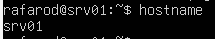

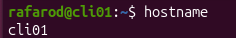

Este comando lee el contenido del archivo /etc/hostname. Al devolver srv01 o cli01, confirmas que el nombre asignado es persistente y no se ha perdido al apagar el equipo.

Comprobación de la Dirección IP

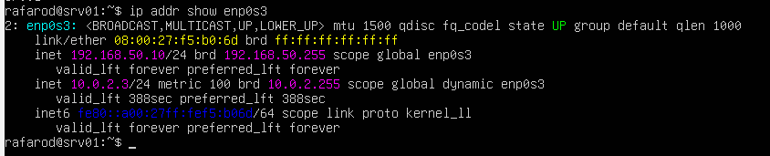

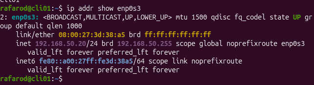

Muestra la dirección IP lógica asignada a la interfaz de red.

Comprobación del Servicio SSH

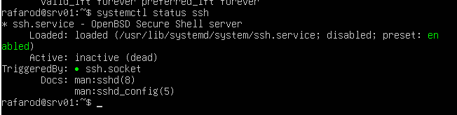

Informa si el servicio está "active (running)" y si está "enabled" (habilitado para arrancar solo). Tras haber generado las llaves de host previamente, el servicio ya no muestra errores de ejecución.

Comprobación del Puerto de Escucha

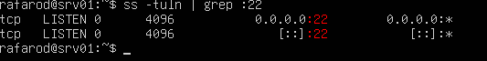

El comando ss (socket statistics) verifica que el puerto 22 está en estado "LISTEN". Esto asegura que el proceso sshd o el ssh.socket están operativos y esperando clientes.

Prueba de Conexión Real

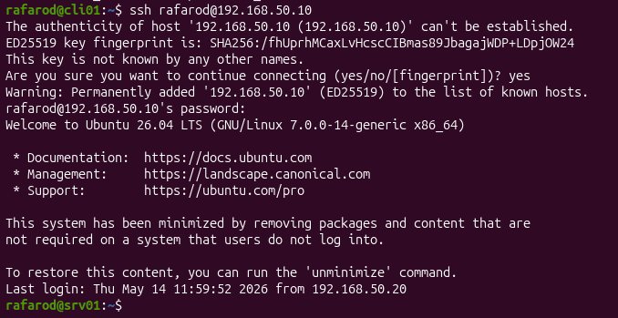

Al intentar entrar desde cli01, el sistema solicita la contraseña del usuario rafarod. Si logras entrar y ver el banner de bienvenida de Ubuntu, se confirma la persistencia total de la red, el servicio y la identidad del usuario.